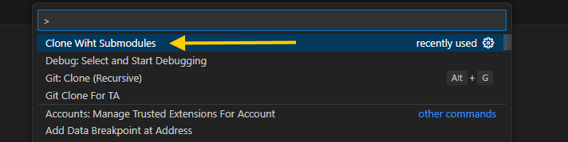
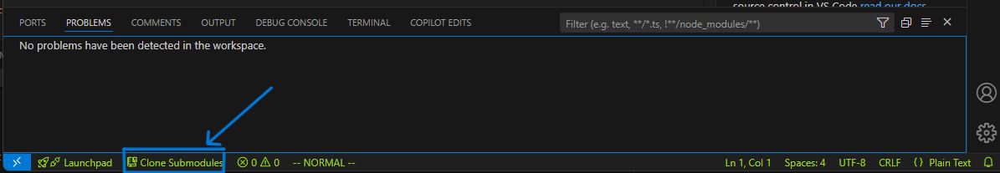

# Git Clone Recursively - VSCode Extension

## Description

This Visual Studio Code extension enables users to clone a Git repository recursively, including all its submodules. It provides a command that prompts the user to enter a repository URL and select a target directory. The extension then executes the `git clone --recursive` command to download the repository and update all its submodules. After cloning, users can choose to open the repository in the current workspace, a new window, or add it to the current workspace.

## Features

- Clone a Git repository recursively, including all submodules.
- Prompts the user to select a target directory for cloning.
- Displays the cloning process output in the **Output** panel.
- Provides options to open the cloned repository in the current workspace, a new window, or add it to the workspace.
- Includes a status bar item for quick access to the cloning functionality.

## Usage

1. Open the Command Palette (`Ctrl+Shift+P` or `Cmd+Shift+P` on macOS).
2. Search for and select the command: **Clone Repo Recursively**.
3. Enter the repository URL when prompted.
4. Select the target directory where the repository should be cloned.
5. After cloning, choose how to open the cloned repository:
   - Open in the current workspace.
   - Open in a new window.
   - Add to the current workspace.

## Command Pallete Screenshot

Alternatively, you can use the status bar item:
- Click on the status bar item labeled `Clone Repo Recursively` to trigger the cloning process.

## Status Bar Item Screenshot 

## Commands

| Command ID                       | Description                          |
|----------------------------------|--------------------------------------|
| `clonewithsubmodule.CloneRepoRecursively` | Prompts the user to clone a repository recursively. |

## Status Bar Item

- **Text**: `$(repo-clone) Clone Repo Recursively`
- **Tooltip**: `Click to clone a repository recursively`
- **Command**: `clonewithsubmodule.CloneRepoRecursively`

## Error Handling

- If no repository URL is provided, the extension displays an error message: `A valid repository URL is required to clone.`
- If the selected directory already contains a folder with the same repository name, the extension displays an error message: `The selected directory already contains a folder with the same repository name. Please select a different directory.`
- If the cloning process fails, the extension displays an error message with the process exit code.

## Requirements

- Git must be installed and available in your system's PATH.

## License

This extension is licensed under the MIT License.
