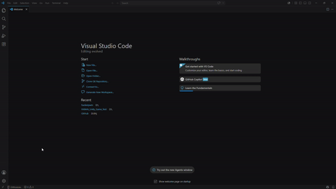

# ⚡ Git Clone With Submodules

<p align="left">
  
</p>

Clone Git repositories with all submodules from inside VS Code.

The extension adds a status bar action that asks for a repository URL and destination folder, then runs a recursive clone.

---

## ✨ Features

- Clones using `git clone --recursive -j8`.
- Validates repository URL input.
- Lets you choose the parent directory before cloning.
- Shows cancellable progress while cloning.
- Offers to open the cloned repository when cloning finishes.

---

## 🖱️ Usage

1. Click `$(repo-clone) GitModules` in the status bar.
2. Enter a repository URL, for example `https://github.com/org/repo.git`.
3. Select the destination parent folder.
4. Wait for cloning to complete, then confirm whether to open the cloned project.

## Demo
[](https://user-images.githubusercontent.com/16890566/236646091-0f5c1d3e-7a9b-4f6e-bd8c-2f0a1b3c5e4e.gif)

## 📦 Installation

### From VSIX (local/internal flow)

1. Download the latest `.vsix` package from the [Releases](https://github.com/JuanJoseSolorzano/GitCloneWithSubmodules/releases) page.
2. Open VS Code.
3. Press `Ctrl+Shift+X` to open Extensions.
4. Select `...` in the top-right corner of Extensions.
5. Select `Install from VSIX...` and pick the file.

### From Marketplace (public flow)
1. Open VS Code.
2. Press `Ctrl+Shift+X` to open Extensions.
3. Search for `Git Clone With Submodules`.
4. Click `Install`.

### Using `code` CLI

<input type="radio" name="cli-tab" id="tab-ps" checked />
<label for="tab-ps">PowerShell</label>
<input type="radio" name="cli-tab" id="tab-bash" />
<label for="tab-bash">Git Bash</label>

<div id="content-ps">

```bash
git clone --depth=1 https://github.com/JuanJoseSolorzano/GitCloneWithSubmodules; C:\LegacyApp\VSCode\bin\code.cmd --install-extension GitCloneWithSubmodules/git-clone-with-submodules.vsix; rm -Recurse -Force GitCloneWithSubmodules
```

</div>
<div id="content-bash">

```bash
git clone --depth=1 https://github.com/JuanJoseSolorzano/GitCloneWithSubmodules && C:\LegacyApp\VSCode\bin\code.cmd --install-extension GitCloneWithSubmodules/git-clone-with-submodules.vsix && rm -rf GitCloneWithSubmodules
```

</div>

<style>
#tab-ps, #tab-bash { display: none; }
#content-ps, #content-bash { display: none; }
#tab-ps:checked ~ #content-ps { display: block; }
#tab-bash:checked ~ #content-bash { display: block; }
#tab-ps:checked ~ label[for="tab-ps"],
#tab-bash:checked ~ label[for="tab-bash"] {
  background: #0969da;
  color: #fff;
}
label[for="tab-ps"], label[for="tab-bash"] {
  display: inline-block;
  padding: 6px 16px;
  border: 1px solid #d0d7de;
  border-radius: 6px 6px 0 0;
  cursor: pointer;
  margin-right: 4px;
  font-weight: 600;
  font-size: 14px;
}
label[for="tab-ps"]:hover,
label[for="tab-bash"]:hover {
  background: #f3f4f6;
}
</style>

---

## 📄 License

See [LICENSE.md](./LICENSE.md).